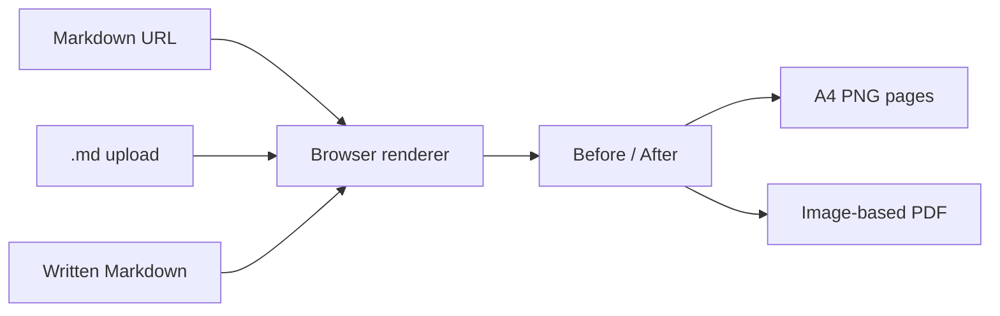
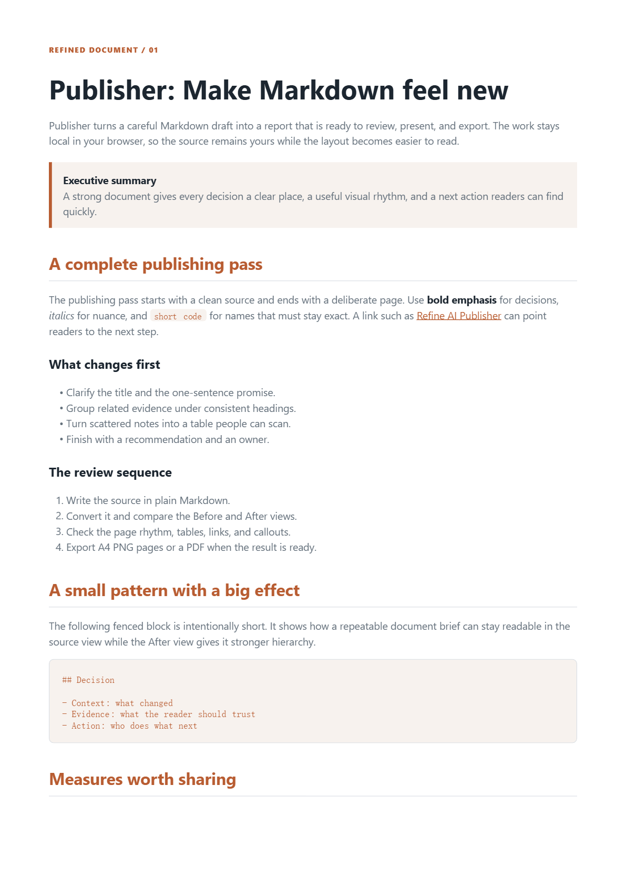
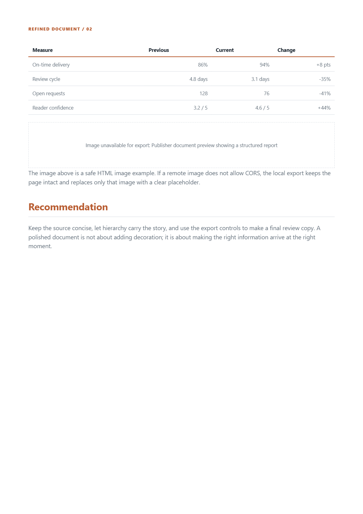

# Markdown to PDF Beautifier

<p align="center">
  
</p>

<p align="center">
  <strong>Turn Markdown into a polished, browser-ready document preview.</strong><br>
  <sub>GFM · Mermaid · KaTeX · syntax highlighting · A4 images · PDF export</sub>
</p>

<p align="center">
  <a href="../../actions"></a>
  
  <a href="https://refineaidocs.com/"></a>
</p>

> A lightweight client-side Markdown presentation and export demo. Open it in a modern browser, compare **Before / After**, then export A4 images or a PDF locally.

## Live Demo

You can open `index.html` directly for upload and handwritten Markdown, or publish this folder with GitHub Pages. For URL input and the most reliable browser behavior, use a static server. The default source is a public Markdown README.

The demo does not upload document content to a conversion server. Markdown is rendered in the browser. External rendering libraries are loaded from public CDNs when the page starts.

## What It Shows



| Capability | Included |
| --- | --- |
| GitHub-Flavored Markdown | Tables, task lists, alerts, links, headings |
| Rich blocks | Mermaid diagrams, KaTeX formulas, highlighted code |
| Preview modes | Source-style Before and three After themes |
| Page handling | A4 layout, repeated table headers, row-aware table pagination |
| Document safety | DOMPurify sanitization and safe URL filtering |
| Local output | A4 PNG ZIP and image-based PDF |
| Devices | Desktop and mobile browsers with responsive layout |

## Preview

<p align="center">
  
  
</p>

## Run Locally

For URL loading and reliable local asset behavior, use a small static server:

```bash
cd md-to-pdf-product-demo
python3 -m http.server 8174
```

Then open <http://127.0.0.1:8174/> in a browser.

No build step is required. The page is a static HTML application and can be hosted by GitHub Pages, Netlify, Cloudflare Pages, or any ordinary web server.

## Input Modes

1. **URL**: enter an HTTPS Markdown URL. GitHub `blob` links are converted to raw content automatically.
2. **Upload**: select a local `.md` or `.markdown` file.
3. **Write**: edit Markdown directly in the browser.

Choose an After theme, convert the source, compare Before and After, and export when the result is ready.

Do not publish local `output/`, browser screenshots, temporary files, or private API keys with this demo.

## Security Notes

- Remote Markdown is fetched only over HTTPS.
- GitHub `blob` links are converted to their raw URL before fetching.
- Rendered HTML is sanitized before it is inserted into the page.
- Scripts, forms, embedded frames, and unsafe remote URLs are removed.
- A remote Markdown host must allow browser CORS requests for URL mode to work.

## Related Product

For the full macOS document publishing workflow, visit [Refine AI Publisher](https://refineaidocs.com/publisher/). It adds controlled document layouts, AI enhancement workflows, tables, charts, covers, and production PDF output.

## Third-Party Notices

This demo loads the following browser libraries from public CDNs. Their original license and copyright notices remain applicable:

| Dependency | Version used | License |
| --- | --- | --- |
| [marked](https://github.com/markedjs/marked) | 12.0.2 | [MIT](https://github.com/markedjs/marked/blob/master/LICENSE.md) |
| [DOMPurify](https://github.com/cure53/DOMPurify) | 3.1.6 | [Apache-2.0 / MPL-2.0](https://github.com/cure53/DOMPurify/blob/main/LICENSE) |
| [Mermaid](https://github.com/mermaid-js/mermaid) | 10.9.1 | [MIT](https://github.com/mermaid-js/mermaid/blob/develop/LICENSE) |
| [KaTeX](https://github.com/KaTeX/KaTeX) | 0.16.11 | [MIT](https://github.com/KaTeX/KaTeX/blob/main/LICENSE) |
| [highlight.js](https://github.com/highlightjs/highlight.js) | 11.10.0 | [BSD-3-Clause](https://github.com/highlightjs/highlight.js/blob/main/LICENSE) |
| [html2canvas](https://github.com/niklasvh/html2canvas) | 1.4.1 | [MIT](https://github.com/niklasvh/html2canvas/blob/master/LICENSE) |
| [JSZip](https://github.com/Stuk/jszip) | 3.10.1 | [MIT](https://github.com/Stuk/jszip/blob/main/LICENSE.txt) |
| [pdf-lib](https://github.com/Hopding/pdf-lib) | 1.17.1 | [MIT](https://github.com/Hopding/pdf-lib/blob/master/LICENSE.md) |
| [PDF/UA Check](https://www.pdfuacheck.com) |  | The PDF/UA Format Support  |

The **Technology** theme is an original visual treatment in this demo.

When a user supplies a GitHub URL, the linked Markdown is user-selected content. The original author remains responsible for that content; no GitHub affiliation, endorsement, or authorization is implied.

